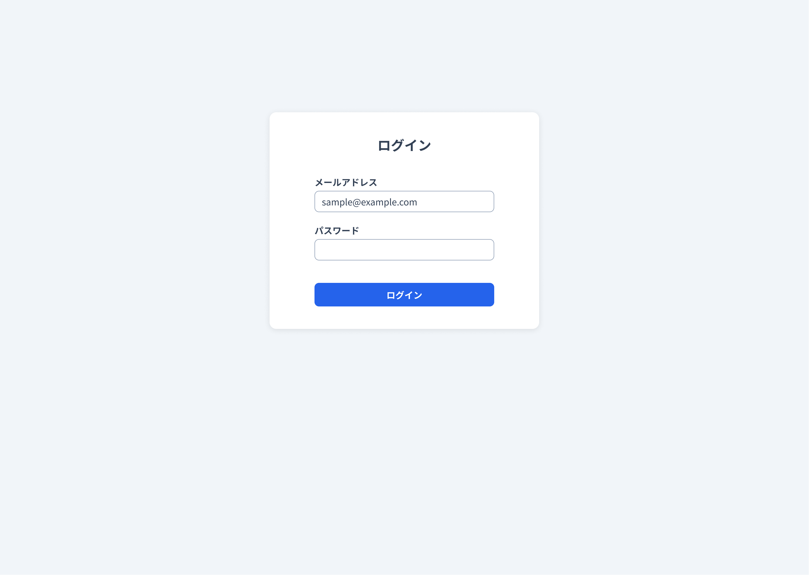
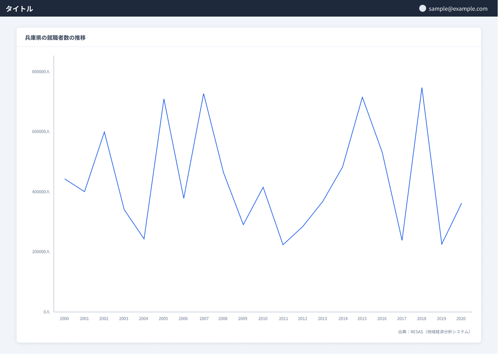
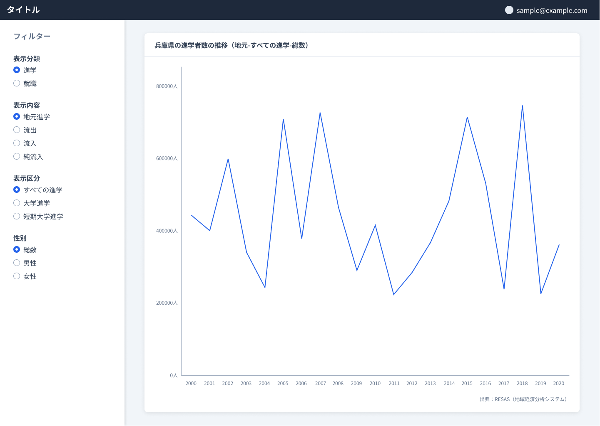
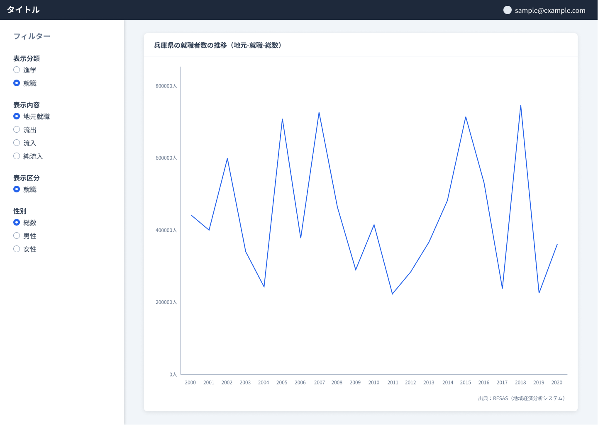
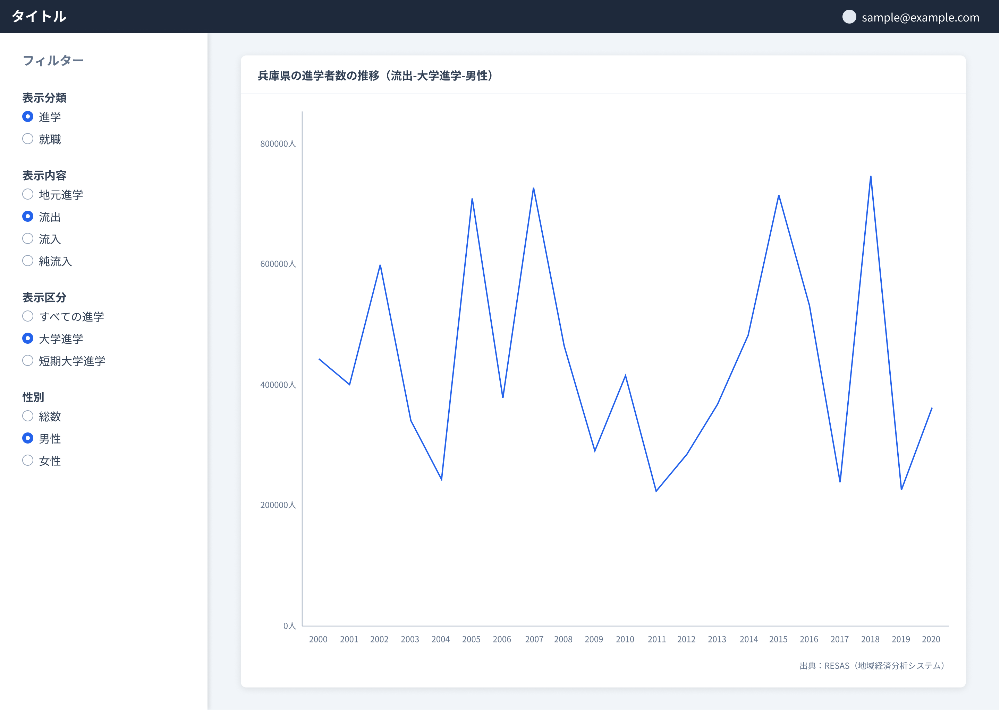

# フロントエンドコーディング試験

## 課題

React を用いてデスクトップアプリの実装をする。

### 内容

お渡しする Figma データを参考に、以下の画面を実装する。

- ログイン画面

#### ログイン画面

- メールアドレス、パスワードが入力できる。
- [オプション課題](#オプション課題)の[グラフ表示画面](#グラフ表示画面)を実装する場合、[ログイン]ボタンをクリックすると、グラフ表示画面に遷移する。
  - 認証処理の実装は不要。
  - メールアドレス、パスワードが未入力でも[ログイン]ボタンをクリックすると、グラフ表示画面に遷移すること。

### オプション課題

ログイン画面に加え、以下の内容を対応していただけると、採点者は喜びます。

- デザインカンプの追求
- レスポンシブ
- テストコード
- リンター/フォーマッター
- コンポーネントカタログ
- グラフ表示画面の実装
  - 実装内容は[グラフ表示画面](#グラフ表示画面)に記載しています。
- その他、アピールできるものがありましたら実装をお願いします。

#### グラフ表示画面

- 兵庫県の就職者数・進学者数の推移グラフを表示する。
  - RESAS-API から取得すること。
    - パラメーター
      - 都道府県コード: RESAS-API の「都道府県一覧」API から取得できる兵庫県の都道府県コード
      - 表示方法: 実数
      - 表示内容: 地元就職
      - 表示分類: 就職
      - 表示区分: 就職
      - 性別: 総数
  - X 軸:年、Y 軸:就職者数・進学者数の折れ線グラフを表示すること。
- ログイン画面で入力したメールアドレスをヘッダーに表示する。

- パラメーターの変更ができる（※オプション課題のオプション）。
  - 以下のパラメーターを切り替えられる UI を実装すること。
    - 表示分類
    - 表示内容
    - 表示区分
    - 性別
  - パラメーターを UI で切り替えると、グラフも動的に表示が切り替わること。
  - 表示分類を変更すると、適切な表示区分が選択できる UI にすること。

### 制約

- [React](https://react.dev/)を用いて SPA（Single Page Application）を実装すること。
- TypeScript で記述すること。
- お渡しする Figma データと同じ見た目になるように実装をすること。
  - Figma データは[Figma へのファイルのインポート](https://help.figma.com/hc/ja/articles/360041003114-Figma%E3%81%B8%E3%81%AE%E3%83%95%E3%82%A1%E3%82%A4%E3%83%AB%E3%81%AE%E3%82%A4%E3%83%B3%E3%83%9D%E3%83%BC%E3%83%88)を参考にインポートしてください。
- Microsoft Edge 最新版で正しく動作すること。
- ソースコードは Git で管理すること。
- フォントは[Noto Sans Japanese](https://fonts.google.com/noto/specimen/Noto+Sans+JP)を使用すること。
- UI フレームワークなどは使用しないこと。
  - CSS ライブラリ、グラフライブラリに依存するライブラリについては使用可能です。
  - スタイリング力を測るための制約です。
- グラフ表示画面内にあるアイコン（Avatar）は [assets/Avatar.svg](./assets/Avatar.svg) を使用すること。
- グラフはサードパーティー製のグラフライブラリ（Recharts, Chart.js, ApexCharts など）を用いて描画すること。
  - グラフの見た目はデザインカンプと一致しなくても問題ないです。
- API Key は環境変数から参照するように実装すること。
  - セキュリティーの観点からソースコードに含めないでください。

### 注意事項

- GitHub のアカウント登録(無料)をお願いします。
  - 登録していただいたアカウントでソースコードをアップロードしていただきます。
- Figma のアカウント登録(無料)をお願いします。
  - 実装していただくアプリの見た目を確認するのに使用していただきます。
- [オプション課題](#オプション課題)の[グラフ表示画面](#グラフ表示画面)を実装する場合、RESAS-API の利用登録(無料)をお願いします。
  - API Key を発行し、アプリを作成してください。
- 本試験内容を無断で共有、配布、または公開は行わないでください。

### 参考

- [Figma](https://www.figma.com/ja/)
- [GitHub](https://github.com/)
- [RESAS-API](https://opendata.resas-portal.go.jp/)

### 実装例

以下は実装例です。

※デスクトップで表示してください。モバイルだと正しく表示されない可能性があります。

- [Design Exam Sample App](https://gux-rwlt.github.io/design-exam/)

## 期限

課題をお渡しした日から 1 週間以内でお願いします。

例）10/01 に課題をお渡しした場合、締め切りが 10/08 23:59 まで

## 提出方法

ソースコードの提出をお願いします。
GitHub の リポジトリの URL をご連絡ください。
リポジトリは閲覧できるように public に設定してください。

## 連絡先

フロントエンドコーディング試験に関して、ご質問・疑問点などがありましたら、以下の連絡先までお問い合わせください。

- 神澤：kanzawa@mail.glory.co.jp
- 中堀：nakahori@mail.glory.co.jp

グローリー株式会社
